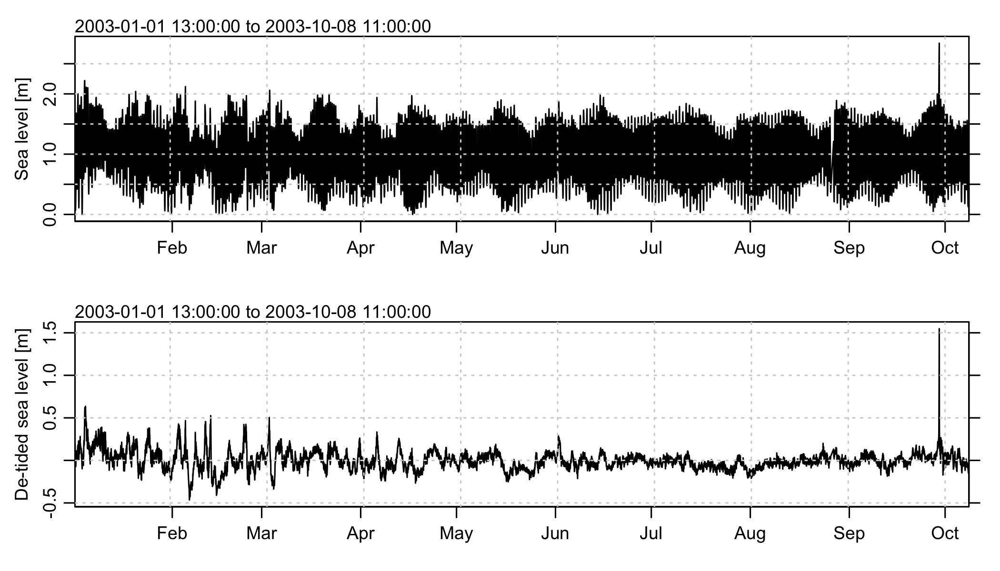

# Statement of Need

Oceanographic field experiments often employ a suite of instrument types, each
reporting data in a different format. Many of these formats are complex and
difficult to decode. Manufacturers usually provide software for accessing data
produced by their instruments, but it is usually proprietary and closed-source,
making it difficult for researchers to analyse their data in novel ways or to
combine data from multiple instruments. The `oce` package
[@kelley__aut_oce_2021] addresses such issues in the R language^[The authors are not aware of similarly comprehensive tools in other open-source languages, although there are tools for individual tasks, as noted at https://pyoceans.github.io/sea-py/, for Python tools.] with functions that handle dozens
of data formats. It also has facilities for the specialized calculations and
data displays that are particular to oceanography.  Since `oce` is written in
the R language [@ihaka_r_1996;@r_core_team_introduction_2021], it forms a link
to a vast array of general tools that oceanographers use in their work
[@kelley_oceanographic_2018].

# Overview

The `oce` package has been hosted since 2009 on
CRAN^[CRAN is at https://cran.r-project.org.], the Comprehensive R Archive Network
[@hornik_comprehensive_2012].  The CRAN version, which is updated once or twice
a year, may be installed by typing `install.packages("oce")` in an R console.
Users who need newer features may use
`remotes::install_github("dankelley/oce",ref="develop")` to download and build
the development branch^[Since some components of oce are written in lower-level languages such as Fortran, C and C++, building the package from source requires compilers for those languages. These are freely available, and an oce wiki page (https://github.com/dankelley/oce/wiki/Configuring-a-Linux-Mint-20-system-to-be-able-to-build-oce-from-source) explains how they and other things may be set up, on a variety of computer types.]. Those wishing to view or participate in the development
process are welcome to do so, at \url{https://github.com/dankelley/oce}.

The package has functions for decoding many data formats.  These functions
return S4 objects with slots holding (a) the data, (b) related metadata, and
(c) a log of `oce` functions that made the object.  This is illustrated by
executing the following in an R session, for a built-in object creating by
reading a profiling instrument called a CTD.


```r
library(oce)                           # load library
data(ctd)                              # load a built-in sample file
slotNames(ctd)                         # see 'slot' names
```

![CTD analysis example. Top left: depth variation of temperature and salinity, with pressure as a surrogate for depth (1 decibar corresponds to approximately 1 metre of depth). Top right: depth variation of a potential density anomaly and the square of the buoyancy frequency, two measures indicating the gravitational stability of the water column. Bottom left: co-variation of salinity and temperature, with contours of potential data anomaly. Bottom-right: map of the study region, gray indicating land.](figure_1.png)

In practice, `slotNames()` is seldom used. Rather, the second step after
loading an object, or reading it from a data file, is often to get a textual
overview with `summary(ctd)`, or a graphical overview. For example,
```r
plot(ctd)
```
produces Figure 1, which shows the basic information needed in oceanographic
studies.

It is also common to exert fine-grained control of graphical representations,
e.g.
```r
plot(ctd, which="temperature")         # results not shown
```
plots just the temperature variation with depth. The variations of other
properties may be shown by setting `which` appropriately, and this argument may
also be used to specify other types of plots, in addition to the
depth-variation form.

Besides this `"ctd"` subclass, `oce` supports dozens of other subclasses that
cover a wide range of oceanographic instrumentation.  In every case, the same
`summary()` and `plot()` function calls provide textual and graphical
representations of the data.  This specialization of these two generic
functions simplifies analysis considerably.  For example, if `PATTERN` is a
regular expression that specifies a set of data files, whether of a single
instrument type or multiple instrument types, then

```r
for (file in list.files(PATTERN)) {
    d <- read.oce(file)
    summary(d)
    plot(d)
}
```
will provide information about each data file of interest, forming a good
first stage of analysis.

Oce also provides other generic functions, including `subset()` for focusing on
subsets of data, `handleFlags()` for processing data-quality flags, and `[[`
for accessing data.  The last of these is particularly worthy of note, for two
reasons.

1. `[[` finds information regardless of where it is stored in the object. For
   example, a CTD does not measure longitude and latitude, but if these things
are known, they will be stored in the `metadata` slot, not the `data` slot.
Other objects might have longitude in the `data` slot. This detail is
immaterial to users, because `[[` looks in both slots.  Therefore, code written
for one object type will often work for another type.

2. `[[` can access not just information stored within the object, but also
   things that can be calculated from that information. For example, CTD files
typically hold information from which seawater density may be computed
[@millero_history_2010;@mcdougall_getting_2011], and so `[[` is set up to
compute it, with e.g. `ctd[["density"]]`. This same scheme works for other
computable elements.

The `[[` function acts as a sort of bridge from the oceanographic realm to the
general R realm, with its thousands of useful and well-vetted packages.  This
is one of the ways in which `oce` reduces the need to create new tools, letting
analysts focus on oceanography, not coding.

# Example: Tidal Analysis

A more detailed example may help to solidify some of the key aspects of `oce`.
Many readers will have an interest in tides, so we will work with a record of
sea level in Halifax Harbour.

Consider the code given below, which produces Figure 2.  A built-in sealevel
file is used, to make a reproducible example, but replacing the `data()` call
with a `read.sealevel()` call will handle data files in standard formats.  Note
that the `tidem()` function is fairly sophisticated, with over 500 lines of R
code being used to apply the specialized procedures of tidal analysis
[@godin_analysis_1972;@pawlowicz_classical_2002;@foreman_versatile_2009].

```r
library(oce)                           # load library
data(sealevel)                         # use built-in example dataset
t <- sealevel[["time"]]                # extract time
eta <- sealevel[["elevation"]]         # extract sea level
m <- tidem(sealevel)                   # fit tidal model
etaDetided <- eta - predict(m)         # de-tide observations
par(mfrow=c(2, 1))                     # set up a two-panel plot
oce.plot.ts(t, eta, xaxs="i",          # top: observed sea level
    grid=TRUE, ylab="Sea level [m]")
oce.plot.ts(t, etaDetided, xaxs="i",   # bottom: de-tided sea level
    grid=TRUE, ylab="De-tided sea level [m]")
```




A comparison of the panels in Figure 2 reveals that tides explain much of the
sea level variation in Halifax Harbour.  The lower panel illustrates an
increase of detided variance during the winter months, as expected at a
northern mid-latitude.  More surprising is the large spike towards the end of
September.  This is a result of Hurricane Juan, which swept over Halifax at
that time, causing a storm surge of approximately 1.5m that, along with high
waves, caused major damage in the harbour [@xu_extreme_2012].  (Readers might
find it informative to supply an `xlim` argument to the plot calls, to narrow
in on the event and ponder the significance of its timing with respect to the
tide.)

# Conclusions

The `oce` package provides for many aspects of oceanographic analysis, having
evolved in an open-source environment for more than a decade. For much of that
time, the hosting has been on github.com/dankelley/oce, where users can see the
details of over 9000 git commits and 1700 closed issues.  The developers have
benefited from a supportive user community, members of which have contributed
insightful bug reports and suggestions for improvements.  New features are
added continually, to handle new instrument types, new data repositories, and
new methods. Physical oceanography is a major focus of the package, but we hope
this paper will generate interest in other communities, ranging from
climatologists to those in marine disciplines such as chemistry and biology.
Our other goal is to encourage the development of new R packages, such as
`argoFloats` [@kelley_argofloats_2021], that build upon `oce`.

# Acknowledgments

We thank the many users who have helped with `oce` development over the years,
by finding bugs, suggesting new features, and providing us with manufacturers'
documentation about data formats for various oceanographic instruments.

# References

